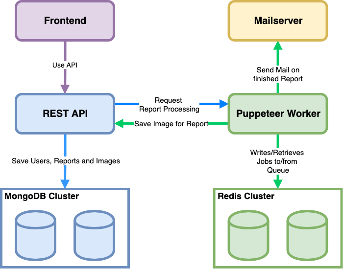

# One Click Checker + K8s = ❤️

> One Click Checker as Backend-System running in Kubernetes and base project and idea for following [Desktop Electron Application with improved functionality](https://github.com/TinkeringAround/occ).

## Test your Websites with 12 popular Testing Tools

```ts
1. Server

- SSLLabs
- Security Headers
- Hardenize

2. Performance

- Lighthouse
- GTMetrix
- KeyCDN

3. SEO & Accessibility

- Seobility
- Varvy
- AChecker

4. Optimization

- Favicon-Checker
- W3 HTML Validation
- W3 CSS Validation
```

## Architecture



**Full JavaScript Stack:**

|                                                       | Tech-Stack            |
| ----------------------------------------------------- | --------------------- |
| Frontend                                              | `Next + React`        |
| REST API                                              | `Express`             |
| Worker                                                | `Express + Puppeteer` |
| Mailserver                                            | `Express`             |
| [Desktop App](https://github.com/TinkeringAround/occ) | `Electron + React`    |

## Ressources

- Powered by [Puppeteer](https://github.com/puppeteer/puppeteer)!
